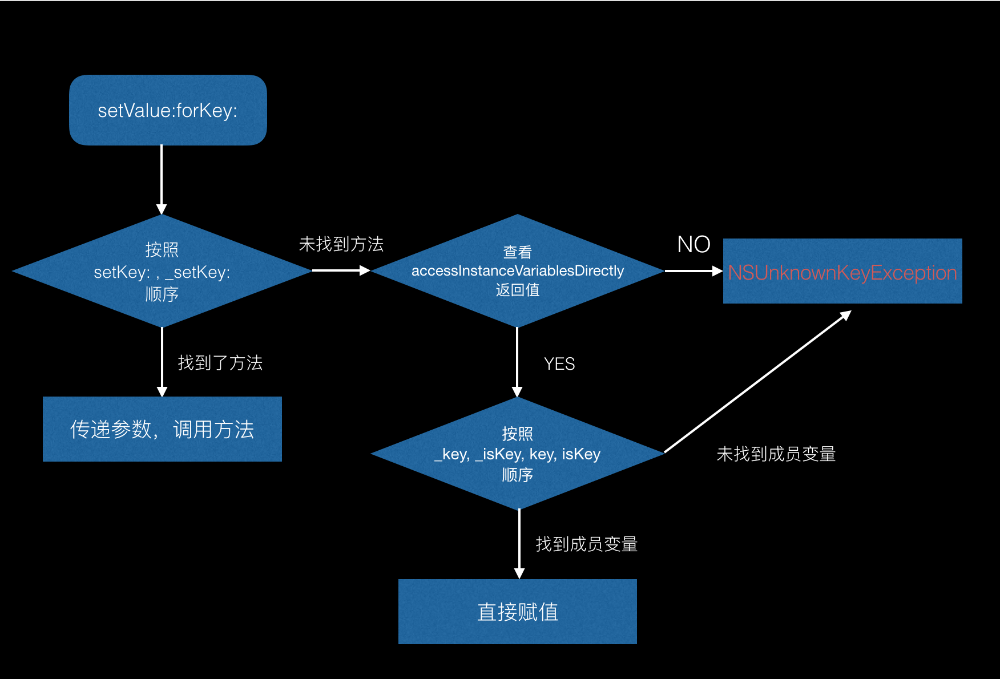
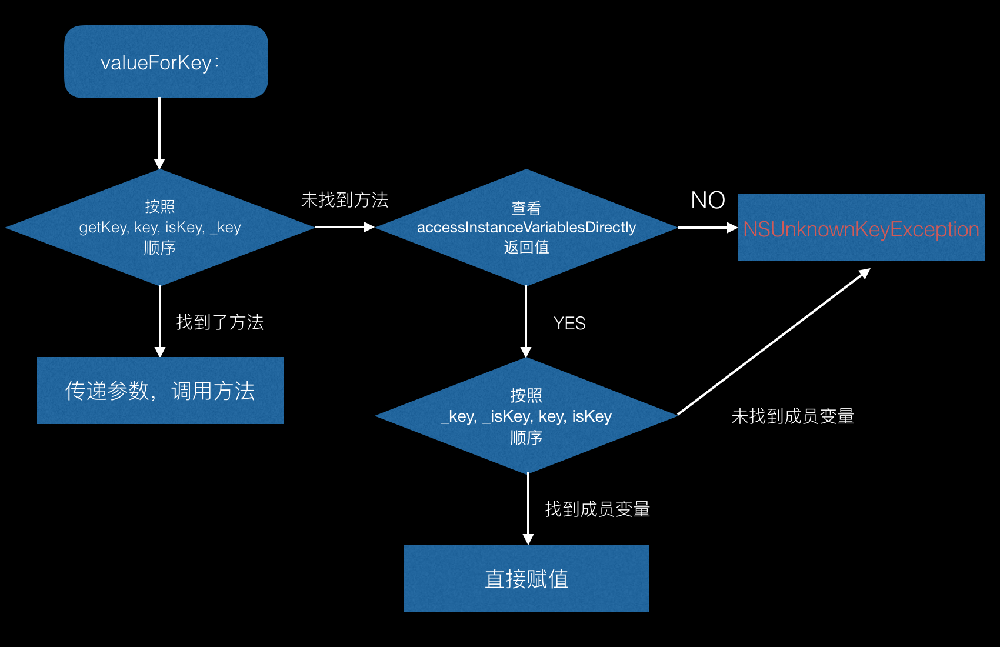

#### 前言

今天我们简单聊一下KVC，键值编码。
平时我们给属性赋值或者取值都是使用点语法，调用属性的set或者get方法，除此之外苹果还为我们提供另一种方法，使用key或者可以keyPath赋值或者取值。

```objc
//赋值
- (void)setValue:(nullable id)value forKey:(NSString *)key;

- (void)setValue:(nullable id)value forKeyPath:(NSString *)keyPath;
- 
// 取值
- (nullable id)valueForKey:(NSString *)key;

- (nullable id)valueForKeyPath:(NSString *)keyPath;
```

具体使用咱就不提了，说说KVC底层具体的实现逻辑吧

#### 赋值




当我们调用了`setValue:forKey:`的时候，比如我们执行下面代码

```objc
[person1 setValue:@10 forkey:@"age"];
```

系统会按照`setAge:`，`_setAge:`的顺序，查找person类中是否实现了这些方法（其中之一即可），如果找到了，则直接调用方法，如果这两个方法否没有找到，下面就从Person类中查找`+ (BOOL)accessInstanceVariablesDirectly`这个方法的返回值。

默认该方法返回的是YES，通过返回值控制是否允许直接给成员变量赋值。因为有些时候我们只是创建了一个成员变量，向下面代码中这样，并没有set方法，所以就要看是否允许直接给成员变量设置值。

```objc
@interface Person : NSObject
{
 @public
 int _age;
}
@end
```

如果不允许直接给成员变量赋值，则直接抛出NSUnknownKeyException错误。

如果是允许给成员变量直接设置值，则会按照_age, _isAge, age, isAge顺便，依次查找成员变量，查找到成员变量，直接赋值，如果找不到这几个成员变量，抛出NSUnknownKeyException错误。

这就是赋值的整个流程，蛮简单的，可能就是这几个顺序容易混掉。

#### 取值

取值的流程跟赋值其实是一样的，只是最开始查找的取值方法是不一样的，大家可以对照下图看一下




