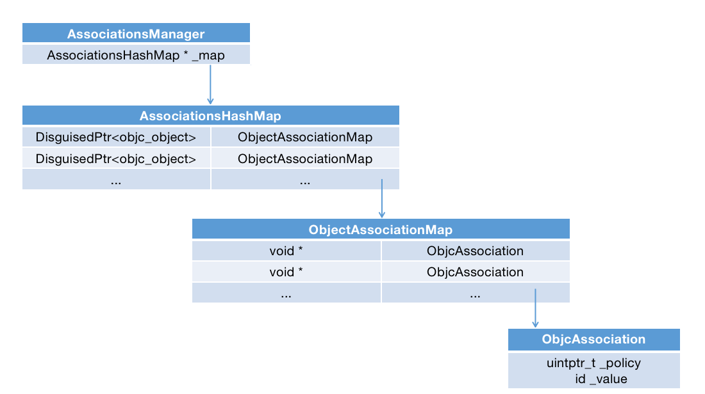
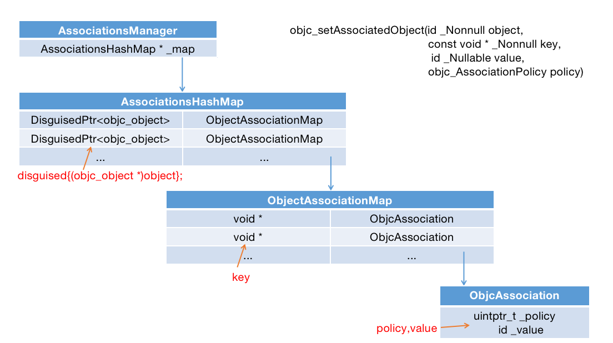

#### 前言

之前我们聊过了，在Category中声明一个属性，可以自己手动实现set和get方法，但是因为没有成员变量，所以说并不能储值。

我们可以通过runtime的api实现让成员变量可以储值，其实本质也并不是储存，而是通过关联对象实现了这种看似是可以储值的效果。

我们可以用下面的方法来设置关联对象。

```objc
objc_setAssociatedObject(id _Nonnull object, const void * _Nonnull key, id _Nullable value, objc_AssociationPolicy policy)

objc_getAssociatedObject(id _Nonnull object, const void * _Nonnull key);
```

今天我们就来探究一下这种关联对象的实现逻辑。

#### 实现

我们在runtime源码中搜索`objc_setAssociatedObject`，最终可以定位到下面这个方法。

```
_object_set_associative_reference
```

通过简单的分析源码，我们可以看出关联对象的实现，大致是由下面四个类结合实现的。

```objc
AssociationsManager
AssociationsHashMap
ObjectAssociationMap
ObjcAssociation
```

简单的抽取和简化一下源码，基本可以得出这四个类的关系。

```objc
class AssociationsManager {
    static AssociationsHashMap * _map
}

typedef DenseMap<DisguisedPtr<objc_object>, ObjectAssociationMap> AssociationsHashMap;

typedef DenseMap<const void *, ObjcAssociation> ObjectAssociationMap;

class ObjcAssociation {
    uintptr_t _policy;
    id _value;
};
```

大家也可以看一下下面这幅图。



这里很清晰的表明了这几个类的关系，AssociationsManager有一个AssociationsHashMap类型的属性_map，_map的key是DisguisedPtr<objc_object>类型，value是ObjectAssociationMap类型，而这个ObjectAssociationMap类型中的key是一个指针（void*），value是ObjcAssociation类型。这个ObjcAssociation中有两个重要的是就是属性，_policy和_value。

关联对象的设置就是通过这几个类来实现的，上面我们也分析完了这几个类的相互关系，那这些类和我们在调用`objc_setAssociatedObject`时传入的参数关系是怎么样的呢？我们继续分析源码。

我们在看一遍下面这方法。

```objc
objc_setAssociatedObject(id _Nonnull object, const void * _Nonnull key, id _Nullable value, objc_AssociationPolicy policy)
```

在调用的时候我们传入了四个参数，第一个就是我们的被关联对象，第二个是我们设置的关联对象的key， 第三个就是我们要存的值，第四个就是关联的策略（类似retain，copy等）

这里先直接说结果吧，其实可以理解为AssociationsManager的属性_map中，以**参数object**为key，value是一个ObjectAssociationMap类型的map。ObjectAssociationMap中，则是以**参数中的key**为key，value是一个ObjcAssociation类型的对象，最后我们**参数中的value和policy**就储存在这个ObjectAssociation变量中。

好了，这样我们传的四个参就跟这些类对应上了。就像下图这样子。




**注意：**

通过源码我们知道，AssociationsHashMap中的key并不是使用直接使用了object，而是一个DisguisedPtr类型，但是通过源码我们可以看到`DisguisedPtr<objc_object> disguised{(objc_object *)object};`，说到底这个key也是根据我们的object来生成的，所以可以说这个key与我们的object是对应关系，从而可以理解为是这个object为key。

不得不说，苹果的设计还是很巧妙的，每一个要设置关联对象的对象对应一个map，在这个map中，使用我们自己设置的不同的关联对象的key为key，用关联对象的value和策略生成一个ObjcAssociation类型的对象为value，然后进行储存，这样每一个要设置关联对象的对象，具体的每一个关联对象，都能一一对应起来了。

上面的话说的有点拗口，相信大家可以理解。

#### 总结和补充

关联对象并不是储存在被关联对象本身的，而是储存在全局的统一的一个AssociationsHashMap中。

从源码中我们还可以看出如果我们给关联对象设置nil，则代表移除该关联对象。

同时还要注意，因为我们的object其实是一个对象，这就要涉及内存管理问题，当我们的这个object释放后，其实整个AssociationsHashMap中其对应项都会被移除，这个以后我们讨论内存管理的时候再说。

objc_getAssociatedObject实现咱们就不具体分析了，如果看动了set的实现，get其实很容易理解。

感谢阅读。


